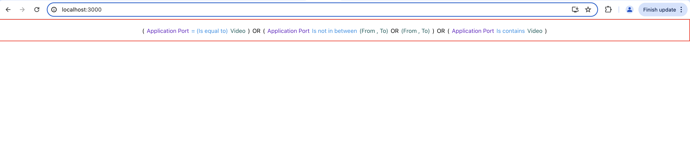

# Getting Started with Create React App

This project was bootstrapped with [Create React App](https://github.com/facebook/create-react-app).

In this, the approach to handle the drodown content when user selects from dropdown/delets from the text field is different from what we have in `main` branch.
This was required to allow user to enter expressions like `(dstIP = host1 or host2)`

# What works as of now
- Supports the filter expression in below format
    - `<Bracket> <Attribute> <Operator> <Value> <Bracket><AND/OR> <Bracket> <Attribute> <Operator> <Value>` 
    - For Example: `(AppProfile = Netflix or Facebook ) and (srcIP = 172.24.147.115 or dstIP = 172.24.147.115)`
    - Allowing OR/AND combination between values
        - Example: `(dstIP = host1 or host2)`
- On clicking inside the textfield a suggestion dropdow opens
    - User can type to filter the suggestions
    - User can user Up/Down arrow keys to navigate between the suggestions options
    - User can use Enter key to select the suggestion
    - Note: All the data is hardcoded.
- For Value field, user can type text and press Enter or Space key. For this in the code the `enableSuggestions` attribute should be set to `false`
- Color coding of attribute, operator, values to make it easy to read.
- User can use backspace to delete in a sequence.
- Add `(` for any expression of format `<attribute> <operator> <value>` automatically if user misses to add one
- Handling the value when certain operators expects two values
    - Example: `dstPort between (80, 120)`

# What needs to be completed
- Validating the user input 
- Handle when user copy pastes some text
- OnFocus open the suggestion dropdown
- On pressing backspace, the suggestion dropdown opens at the begining of the last entry. It should be opened at the end of the last entry

# Should we,
- Restricts user from using Right and Left arrow keys to move between the 
- Restricts user from using mouse to move the cursor anywhere in the text field

## Run it locally

In the project directory, you can run:

### `yarn start`

Runs the app in the development mode.\
Open [http://localhost:3000](http://localhost:3000) to view it in the browser.

The page will reload if you make edits.\
You will also see any lint errors in the console.

### `yarn test`

Launches the test runner in the interactive watch mode.\
See the section about [running tests](https://facebook.github.io/create-react-app/docs/running-tests) for more information.

### `yarn build`

Builds the app for production to the `build` folder.\
It correctly bundles React in production mode and optimizes the build for the best performance.

The build is minified and the filenames include the hashes.\
Your app is ready to be deployed!

See the section about [deployment](https://facebook.github.io/create-react-app/docs/deployment) for more information.

### `yarn eject`

**Note: this is a one-way operation. Once you `eject`, you can’t go back!**

If you aren’t satisfied with the build tool and configuration choices, you can `eject` at any time. This command will remove the single build dependency from your project.

Instead, it will copy all the configuration files and the transitive dependencies (webpack, Babel, ESLint, etc) right into your project so you have full control over them. All of the commands except `eject` will still work, but they will point to the copied scripts so you can tweak them. At this point you’re on your own.

You don’t have to ever use `eject`. The curated feature set is suitable for small and middle deployments, and you shouldn’t feel obligated to use this feature. However we understand that this tool wouldn’t be useful if you couldn’t customize it when you are ready for it.

## Learn More

You can learn more in the [Create React App documentation](https://facebook.github.io/create-react-app/docs/getting-started).

To learn React, check out the [React documentation](https://reactjs.org/).
